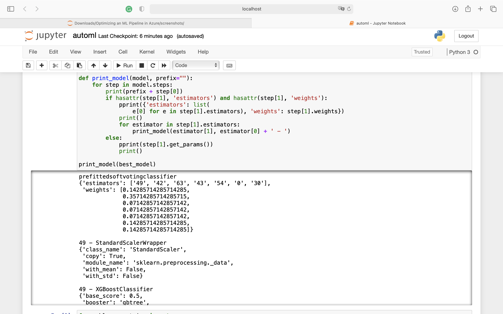
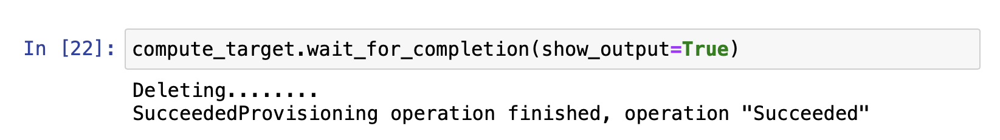

# Optimizing an ML Pipeline in Azure

## Overview
In this project, I constructed ML pipelines using scikit-learn, Hyperdrive, and AutoML. First, I constructed a pipeline with scikit-learn. Second, I configured a Hyperdrive run to find the optimal hyperparameters. Lastly, I configured an AutoML run to find an optimal model and set of hyperparameters. 

## Summary
I used the [UCI Bank Marketing dataset](https://archive.ics.uci.edu/ml/datasets/bank+marketing) to solve a classification problem. The classification goal is to predict if the client will subscribe to a term deposit with the bank. The best performing model was an XGBoost classifier instantiated by AutoML. 

## Scikit-learn Pipeline
The pipeline steps include cleaning data, balancing class, split the data into training/validation/test sets, training, testing and savings models. The classification algorithm is logistic regression, which is a binary classifier and one of the simplest models. The hyperparameter tuning focuses on two parameters: inverse of regularization strength and maximum number of iterations to converge.

I used RandomParameterSampling as the parameter sample. Parameter values are chosen from a set of discrete values or a distribution over a continuous range. The main benefit is the simplicity and relatively smaller number of runs. 

I used the BanditPolicy as the early stopping policy. Early termination is based on slack criteria, and a frequency and delay interval for evaluation. Any run that doesn't fall within the slack factor or slack amount of the evaluation metric with respect to the best performing run will be terminated. The benefit is that the current best run is used as the benchmark and you can customize how slack_factor and evaluation_interval. 

## AutoML
The model includes a MaxAbs scaler and a XGBoost classifier. 
- The max_depth parameter took a value of 3. It defines the maximum number of layers. Shallow trees are simpler because they capture few details of the problem and are generally referred to as weak learners. Deeper trees generally capture more details of the problem and may overfit the training dataset, limiting the ability to make good predictions on new data. 
- The n_estimator parameter took a vaule of 100. Most implementations of gradient boosting are configured by default with a relatively small number of trees. For most problems, adding more trees beyond a limit does not improve the performance of the model. Because the boosted tree model is constructed sequentially, where each new tree attempts to model and correct for the errors made by the sequence of previous trees. Quickly, the model reaches a point of diminishing returns.
- The learning_rate parameter took a value of 0.01. Gradient boosting involves creating and adding trees to the model sequentially. New trees are created to correct the residual errors in the predictions from the existing sequence of trees.
The effect is that the model can quickly fit, then overfit the training dataset.The learning rate is used to slow down the learning in the gradient boosting model by applying a weighting factor for the corrections by new trees when added to the model. It is common to have small values in the range of 0.1 to 0.3, as well as values less than 0.1.

## Pipeline comparison
Weighted AUC is the metric used for comparison. AUC is the  Area Under the Receiver Operating Characteristic Curve (ROC AUC) from prediction scores. It balances true positive and false positive rates. The "weighted" option calculates metrics for each label, and find their average, weighted by the number of true instances for each label. The AutoML pipeline chose a more complex model that has a higher Weighted AUC score, The Hyperdrive pipeline used a very simple model that has a slightly lower AUC score.

## Future work
For the Hyperdrive pipeline, I will try a few models that are more complex, including tree based ensemble models that have more parameters to tune.  For the AutoML pipeline, I will experiment with more settings including the featurization. It is currently turned off because the data has been cleaned. 

## Proof of cluster clean up

